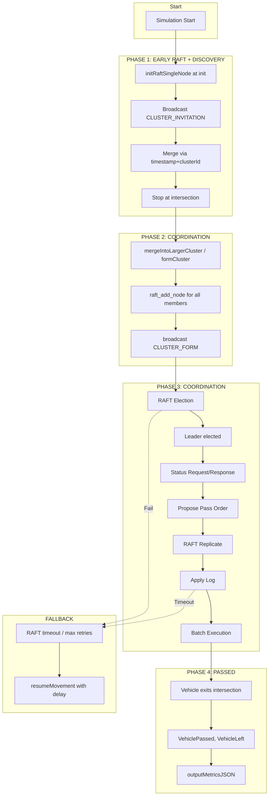

# V2V RAFT Intersection Coordination — Algorithm Reference

> Stack: **OMNeT++ 5.6.2 + INET 4.4.x + Veins + SUMO**
> Protocols compared: **UDP over IEEE 802.11a** vs **WAVE over IEEE 802.11p**
> Benchmark: **4, 8, 16 vehicles** | Stop distance **5 m** | RAFT starts at init; proposal after **5 s** stopped

---

## Current Algorithm Summary (Simple Intersection)

| Parameter | Value |
|-----------|-------|
| Vehicle counts | 4, 8, 16 |
| `intersectionStopDistance` | 5 m |
| `discoveryWaitMs` | 5000 ms |
| `clusterFormationDelayMs` | 0 ms |
| UDP channel | CH36 (5.18 GHz 802.11a) |
| WAVE channel | CH178 (5.89 GHz 802.11p CCH) |
| RAFT start | At init (single-node per vehicle); merges form larger cluster |
| Proposal gate | 5 s stopped (discoveryWaitMs + clusterFormationDelayMs) before status request |
| invitationIntervalStoppedMs | 10 ms (when stopped: invitation interval; configurable) |
| Throughput formula | N_raft / (last_raft_passed − first_raft_passed) |
| UDP receiver sensitivity | -82 dBm (802.11a 20 MHz @ 6 Mbps) |
| WAVE sensitivity | -88 dBm (802.11p 10 MHz @ 6 Mbps) |
| Transmit power (both) | 200 mW (23 dBm, OBU-class) |
| Merge rule | Timestamp + clusterId: older timestamp wins; tie-break by lower clusterId |
| WAVE gossip TTL | `totalVehicles_` — unicast messages relayed with this hop limit |
| `statusCollectionTimeoutMs` | UDP: 800 ms; WAVE: 800 ms (simple_intersection) — leader proceeds with defaults if responses lost |
| `resultsFileCloseAtSec` | 299 — force-close results JSON at sim end (avoids truncation when not all vehicles stop) |

---

## 0. What Each File Does

### RaftAppBase Implementation Files (split by responsibility)

The shared RAFT protocol logic lives entirely in the `RaftAppBase` class, but is split across **7 implementation files** for maintainability. All files simply define methods of `class RaftAppBase` and include only `RaftAppBase.h` — no new classes, no circular dependencies, no API changes.

> **To change the crossing policy:** edit only `RaftDecision.cc`. Everything else stays the same.

| File | Role | ~Lines |
|------|------|--------|
| `src/raft/RaftAppBase.h` | **Abstract base class header.** All member variable declarations, nested types, method declarations. Pure-virtual transport interface (3 methods). | ~300 |
| `src/raft/RaftAppBase.cc` | **Constructor, destructor, `parseEdgeParameters`.** Member initializer list only; no protocol logic. | ~95 |
| `src/raft/RaftDiscovery.cc` | **Cluster discovery and merge.** `sendClusterInvitation`, `handleClusterInvitation`, `initRaftSingleNode`, `formCluster`, `mergeIntoCluster`, `mergeIntoLargerCluster`, `broadcastClusterForm/Exists`, `handleClusterForm/Exists`, `sendLateJoinOrderTo`, `handleLateJoinOrder`. | ~390 |
| `src/raft/RaftCore.cc` | **RAFT protocol engine.** `processRaftPeriodic`, all 6 willemt/raft static callbacks (`sendRequestVote`, `sendAppendEntries`, `logOffer`, `applylog`, `raftLog`, `persistVote`, `logGetNodeId`), all serialize/deserialize methods, `sendStatusRequest`, `proposeStatusReport`, `proposePassOrder` (calls `computePassOrder()`), `proposeVehicleLeft`, `applyVehicleLeftFromRaft`, `onBecameLeader`, `onLostLeadership`. | ~420 |
| `src/raft/RaftDecision.cc` | **Crossing-order scheduling algorithm.** `computePassOrder` (pure: proposals in → `PassScheduleEntry` out), `getLaneIndex`, `movementsConflict`, `executePassOrder`, `applyCommittedPassOrder`. **Edit only this file to change the pass policy.** | ~175 |
| `src/raft/RaftCoordination.cc` | **Follower-side coordination handlers.** `handleStatusRequest`, `sendStatusResponse`, `handleStatusResponse`, `handleStatusResponseProposal`, `collectStatusAndDecide`, `handleVehiclePassed`, `handleVehicleLeft`, `handleVehicleLeftGossip`. | ~130 |
| `src/raft/RaftExit.cc` | **Intersection exit and metrics.** `sendVehiclePassed`, `sendVehicleLeft`, `markRaftNodeInactive`, `scheduleVehicleLeftTimeout`, `checkBatchAdvance`, `checkIfLeftIntersection`, `outputMetricsJSON`. | ~150 |
| `src/raft/RaftUtilities.cc` | **Intersection control, fallback, gossip relay.** `buildMyProposal`, `detectBlockingVehicle`, `calculateDistanceToJunction`, `checkAndStopAtIntersection`, `checkAndAdvanceInQueue`, `isAtIntersection`, `isNearJunction`, `hasPassedIntersectionEdge`, `calculateWayOfSight`, `stopVehicle`, `resumeMovement`, `handleFallback`, `computeGossipKey`, `tryRelayGossip`. | ~270 |

### Transport Subclasses and Supporting Files

| File | Role |
|------|------|
| `src/raft/UdpRaftApplication.h / .cc` | **UDP subclass (~450 lines).** Extends `VeinsInetApplicationBase` (INET). Implements the 3 pure-virtual transport methods using INET `UdpSocket` on 802.11a. Handles OMNeT++ packet send/receive and dispatches received bytes to the base-class handlers. Reads `isAmbulance` NED param and sets vehicle colour to red in SUMO-GUI. |
| `src/raft/WaveRaftApplication.h / .cc` | **WAVE subclass (~434 lines).** Extends `DemoBaseApplLayer` (Veins). Implements the same 3 virtual methods using Veins `WaveShortMessage` (WSM) on 802.11p / DSRC. Handles Veins send/receive and gossip relay dispatch. Reads `isAmbulance` NED param and sets vehicle colour to red in SUMO-GUI. |
| `src/raft/RaftShared.h` | **Shared structs and enums.** Defines `ClusterPhase`, `LogEntryType`, `VehicleProposal` (includes `isPriority` field), `PassOrderEntry`, `PassBatch`, `PassScheduleEntry`, `VehicleLeftEntry`, `CommittedSchedule`. Also includes `CryptoAuth.h` for `VehicleCert` and `SignedProposal`. |
| `src/raft/CryptoAuth.h / .cc` | **ECDSA P-256 certificate engine (OpenSSL).** Singleton. Generates `Emergency_CA` and `Vehicle_CA` keypairs at startup. Each vehicle calls `generateKeyPair()` + `issueCert()` at init. Provides `signProposal()`, `verifyCert()`, `verifyProposalSignature()`. Linked with `-lssl -lcrypto`. |
| `src/raft/RaftMetrics.h / .cc` | **JSON output collector.** Static singleton-like class. Vehicle 0 (UDP) or first init (WAVE) opens the results file; all vehicles with `hasStoppedAtIntersection_` append their record. File closes when `vehiclesCompleted_ >= totalVehicles_` **or** at `resultsFileCloseAtSec` (default 299), which avoids truncated JSON when not all vehicles stop before sim-time-limit. |
| `src/raft/RaftWaveMessage.msg` | **OMNeT++ message definition** for the WAVE WSM payload. Fields: `msgType`, `senderId`, `targetId`, `originalSenderId` (for relay), `gossipTtl` (hops left). Auto-generates `RaftWaveMessage_m.h/cc`. |
| `src/raft/RaftLogger.h` | Logging macros wrapping `EV_INFO` / `EV_WARN`. |
| `third_party/raft/raft.h / .c` | **willemt/raft C library.** Pure C implementation of the Raft consensus algorithm. Compiled statically into the OMNeT++ binary. |
| `simulations/simple_intersection_N/omnetpp_udp.ini` | OMNeT++ config for UDP scenario (N = 4, 8, or 16). Sets radio, channel, INET params, RAFT timing, discovery wait, and cluster formation delay. |
| `simulations/simple_intersection_N/omnetpp_wave.ini` | Same for WAVE. Uses Veins and 802.11p channel settings. |
| `simulations/simple_intersection_N/intersection.rou.xml` | SUMO route file. 4 directions (W,S,E,N), vehicles start far (departPos 0–140 m), 20 m spacing. |
| `simulations/simple_intersection_N/intersection.launchd.xml` | Veins launchd config. Tells `veins_launchd` which SUMO config files to stage. |
| `run_simple_benchmark.sh` | **Simple benchmark runner.** Runs UDP and WAVE for 4, 8, 16 vehicles (configurable iterations, default 3, e.g. `./run_simple_benchmark.sh 10`), aggregates stats, runs `plot_comparison.py --simple`. |
| `plot_comparison.py` | Reads result folders and generates RAFT Decision Time + Throughput comparison plot (UDP vs WAVE). |

### How the Split Works (C++ Multi-file Class Implementation)

Each new `.cc` file simply defines methods of `class RaftAppBase`:

```cpp
// e.g. RaftDecision.cc
#include "raft/RaftAppBase.h"

PassScheduleEntry RaftAppBase::computePassOrder(
    const std::map<int, VehicleProposal>& proposals,
    const std::set<int>& activeVehicles)
{
    // greedy batch-builder — edit this to change crossing policy
    ...
}
```

All methods access `this->` member variables directly. No new classes, no friend declarations, no pointer passing. The `src/Makefile` lists each `.o` explicitly in `OBJS`.

**`proposePassOrder()` in `RaftCore.cc` handles RAFT bookkeeping; it delegates the pure scheduling decision to `computePassOrder()` in `RaftDecision.cc`:**

```cpp
// RaftCore.cc — proposePassOrder()
PassScheduleEntry schedule = computePassOrder(collectedProposals_, activeVehicles_);
// ... wrap schedule in a RAFT log entry and call raft_recv_entry(...)
```

### Difference Between UDP and WAVE Subclasses

| Aspect | UDP (`UdpRaftApplication`) | WAVE (`WaveRaftApplication`) |
|--------|-------------------------------|-------------------------------------|
| **Base class** | `VeinsInetApplicationBase` | `DemoBaseApplLayer` |
| **Radio** | IEEE 802.11a, CH36 (5.18 GHz), INET UdpSocket | IEEE 802.11p, CH178 (5.89 GHz) DSRC, Veins WSM |
| **Unicast** | `UdpSocket::sendTo(packet, destAddr, port)` | `sendDirect()` or `sendDown()` with dest MAC |
| **Broadcast** | `UdpSocket::sendTo(packet, broadcast, port)` | `sendWSM()` with broadcast MAC |
| **Unicast relay** | N/A — UDP is IP-level point-to-point | **Gossip relay:** intermediate vehicles rebroadcast unicast messages toward `targetId`; TTL = `totalVehicles_` |
| **Packet type** | INET `Packet` with `UdpHeader` + `BytesChunk` | Veins `RaftWaveMessage` (WSM subclass) |
| **Mobility** | `VeinsInetMobility` — wraps Veins TraCI | `TraCIMobility` — direct Veins TraCI |
| **Cluster invitation** | sendClusterInvitation when `!hasPassedIntersection_`; 2.0 s during COORDINATION | Same in both |
| **Protocol logic** | 100% in `RaftAppBase` (split across 7 `.cc` files) | 100% in `RaftAppBase` (split across 7 `.cc` files) |

---

## 1. The Logic

### 1a. How Cars Talk and Stop

#### Vehicle Identity

```
myId_         = getParentModule()->getIndex()   // 0-based: 0, 1, 2, 3...
myRaftNodeId_ = myId_ + 1                       // 1-based: 1, 2, 3, 4...
```

The willemt/raft library requires 1-indexed node IDs; `myRaftNodeId_` is always `myId_ + 1`.

#### Startup (both subclasses)

At simulation start, every vehicle:

1. Reads all parameters from `.ini` (`totalVehicles`, `electionTimeoutBaseMs`, `invitationIntervalStoppedMs`, `isAmbulance`, etc.)
2. **Crypto init** (via `CryptoAuth` singleton):
   - `generateKeyPair()` → own EC P-256 keypair
   - `issueCert(pubKey, role, issuer)` → cert signed by `Emergency_CA` (if ambulance) or `Vehicle_CA` (normal)
   - Ambulance vehicles are coloured **red** in SUMO-GUI via `traciVehicle_->setColor()`
3. Schedules three recurring timers:
   - **`checkTimer_`** — fires every 50 ms; drives stop detection, queue advancement, exit detection
   - **`discoveryTimer_`** — sends CLUSTER_INVITATION when `!hasPassedIntersection_`; interval = `invitationIntervalStoppedMs`/1000 + jitter when **stopped**, else `discoveryBeaconInterval` (default 0.3 s)
   - **`raftPeriodicTimer_`** — fires every 20 ms; ticks the RAFT library
3. Calls **`initRaftSingleNode()`** — creates RAFT with single-node cluster (self), `clusterPhase_ = PHASE_COORDINATION`, starts `raftPeriodicTimer_`
4. Adds all peer IDs (0 … N-1) to `activeVehicles_`

RAFT runs from init; clusters form via invitation + merge (timestamp+clusterId). No formation gate.

#### Cluster Invitation (Discovery + Merge)

From **startup until `hasPassedIntersection_`**, vehicles send **CLUSTER_INVITATION** (replacing discovery beacons):

```
Msg type: 0x13 (CLUSTER_INVITATION)
Payload: [vehicleId:4B][clusterId:4B][timestamp:8B][numMembers:1B][member0:4B]...
```

- `clusterId` = min(vehicleIds) in cluster; `timestamp` = simTime at first send.
- **Merge rule:** older timestamp wins; tie-break by lower clusterId.
- On receipt: add members to `discoveredPeers_`, adopt winning (clusterId, timestamp).
- **Never stop for `hasCommittedOrder_`** — broadcast continues until the vehicle leaves the intersection (enables late merges and late joiners).

Legacy DISCOVERY_BEACON (0x10) is still supported but CLUSTER_INVITATION is the primary channel.

**PEER_BEACON authentication (0x10):**

Each beacon now carries a `SignedProposal` (cert + ECDSA signature) instead of a raw `VehicleProposal`. Receivers call `verifyCert()` + `verifyProposalSignature()` and store the verified `isPriority` flag in `vehicleDB_[senderId]`. This flag then propagates to all lane leaders via LEADER_DB_EXCHANGE, so the elected RAFT leader can see ambulance status for every vehicle regardless of its position in the lane queue.

#### Stopping at the Intersection

`checkAndStopAtIntersection()` is called by `checkTimer_` every 50 ms:

```
1. Is current road one of approachEdges_?
2. getDistanceToJunction() = laneLength - lanePosition   [TraCI]
3. If distance <= intersectionStopDistance_ (5 m in simple intersection):
     setSpeedMode(0)       // disable all speed control
     setSpeed(0)           // hard stop
     hasStoppedAtIntersection_ = true
     timeStopped_ = NOW
4. Queued vehicles (dist < 4×stopDistance, speed < 1.5 m/s): same flags, no hard stop
```

**Note:** `intersectionStopDistance_` is 5 m in the simple intersection configs. Queued-vehicle zone = 5–20 m (4× stop distance).

#### Queue Advancement

For vehicles behind the front vehicle:

```
checkAndAdvanceInQueue() every 50 ms:
  leader, gap = TraCI.getLeader(4 × stopDistance)   // 20 m with stopDist=5
  if gap > stopDistance:
    setSpeedMode(31)    // restore SUMO car-following
    setSpeed(-1)        // let SUMO drive
  // Vehicle accordions forward, then re-stops automatically
```

---

### 1b. Leader Election Process

#### RAFT Early Start — `initRaftSingleNode()`

Each vehicle starts RAFT at init with a single-node cluster:

```
initRaftSingleNode() (called at initialize/startApplication):
  raft_new(), raft_add_node(self)
  clusterPhase_ = PHASE_COORDINATION, clusterFormed_ = true
  activeVehicles_ = {myId_}
  onClusterFormed() → start raftPeriodicTimer_
```

Merges form larger clusters via CLUSTER_INVITATION: when receiving a "winning" cluster (older timestamp or tie-break lower clusterId), the loser calls `mergeIntoLargerCluster(union)` → dissolves own RAFT, `formCluster(union)`.

#### Invitation Interval When Stopped

When `hasStoppedAtIntersection_`:
- `discoveryTimer_` interval = **`invitationIntervalStoppedMs_`**/1000 + uniform(0, 0.005) s (default 10 ms + jitter)
- Ensures aggressive merge during the 5 s stop window so all clusters converge to one

#### `formCluster(members)` (used by merge)

```
1. raftServer_ = raft_new()
2. For each member vehicle id v:
     raft_add_node(raftServer_, udata=v, nodeId=v+1, is_self=(v==myId_))
3. Register callbacks (see §RAFT Callbacks below)
4. Set election timeout = electionTimeoutBaseMs_ + uniform(0, electionTimeoutJitterMs_)
5. Set request timeout = requestTimeoutMs_
6. clusterPhase_ = PHASE_COORDINATION
7. timeClusterFormed_ = NOW
8. broadcastClusterForm()            // msg type 0x11, payload=[clusterId][timestamp][numMembers][id0][id1]...
9. Schedule CLUSTER_FORM/EXISTS retries at +300, +700, +1200… ms — **never stop for hasCommittedOrder_**; only stop when hasPassedIntersection_
10. onClusterFormed() → start raftPeriodicTimer_
```

#### RAFT Election (inside the willemt/raft library)

Every 20 ms, `raft_periodic(raftServer_, elapsed_ms)` is called. Internally:

```
Follower state:
  Decrement election countdown by elapsed_ms
  When countdown ≤ 0:
    → become CANDIDATE
    → increment current_term
    → call send_requestvote callback for every other node

send_requestvote callback → doSendRequestVote():
  Serialize msg_requestvote_t struct
  sendRaftToPeer(targetId, 0x20, data)   // msg type: RAFT_REQUEST_VOTE

On receiving 0x20:
  raft_recv_requestvote(server, fromNode, &msg, &response)
  sendRaftToPeer(fromId, 0x21, response) // msg type: RAFT_REQUEST_VOTE_RESPONSE

On receiving 0x21:
  raft_recv_requestvote_response(server, fromNode, &response)
  If quorum votes received → become LEADER
  onBecameLeader() called
```

**Key**: Election timeout is **randomised per vehicle** so one vehicle's timeout fires first, wins the election before others even try. With 4 vehicles at `280 ± 160 ms` jitter, the fastest timeout wins in ~280–440 ms after cluster formation.

---

### 1c. Decision Process

Leaders propose **three types** of RAFT log entries:

| Entry type | When proposed | Purpose |
|------------|----------------|---------|
| `STATUS_REPORT` | After status collection | Vehicle statuses (way-of-sight, lane). RAFT entry #1 per ordering cycle. |
| `PASS_SCHEDULE` (PASS_ORDER) | After STATUS_REPORT commits | Pass order: batches of vehicle IDs. RAFT entry #2. |
| `VEHICLE_LEFT` | When a vehicle exits intersection | One per vehicle (vehicleId, batchId). Leader can propose to RAFT; often replaced by gossip path. |

#### Step 1 — Status Request

After **`discoveryWaitMs_` + `clusterFormationDelayMs_`** (5 s) stopped at intersection, the leader broadcasts:

```
msg type: 0x30 (COORD_STATUS_REQUEST)
payload:  [int32 leaderId]
```

Each follower responds with a **`SignedProposal`** (authentication layer added):

```
msg type: 0x31 (COORD_STATUS_RESPONSE)
payload:  struct SignedProposal {
    uint8_t  proposalBytes[256]   // serialized VehicleProposal
    uint32_t proposalSize
    uint64_t timestampMs          // simtime in ms (replay prevention)
    VehicleCert cert {
        uint8_t publicKey[65]     // vehicle's EC P-256 public key
        char    role[16]          // "ambulance" or "normal"
        char    issuer[32]        // "Emergency_CA" or "Vehicle_CA"
        uint8_t caSignature[72]   // CA's ECDSA signature
        uint8_t caSignatureLen
    }
    uint8_t  signature[72]        // vehicle's ECDSA sig over (proposal + timestamp)
    uint8_t  signatureLen
}

struct VehicleProposal {
    int    vehicleId
    char   laneEdgeId[64]    // current SUMO edge
    double positionOnLane    // metres from lane start
    double speed
    int    laneIndex         // 0=West 1=South 2=East 3=North
    int    intendedTurn      // 0=STRAIGHT 1=LEFT 2=RIGHT
    bool   isFirstInLane     // no vehicle ahead in same lane
    int    blockedByVehicleId
    double waitingTimeMs     // time since stopped
    double distanceToJunction
    bool   isPriority        // set by RECEIVER after cert verification — NEVER self-claimed
}
```

**Receiver verification (leader side):**
1. `verifyCert(cert)` — checks CA signature against trusted `Emergency_CA` or `Vehicle_CA` public key → returns role or `""` if forged
2. `verifyProposalSignature(cert, proposalBytes, sig)` — checks payload not tampered
3. Sets `proposal.isPriority = (role == "ambulance")` — only from cert, not from payload
4. Rejects (drops) message if either check fails — logged as `[CRYPTO] REJECT`

If responses are lost, leader uses default proposals (`laneIndex`, `waitingTimeMs=99999`, `isFirstInLane=true`). Leader proceeds after **`statusCollectionTimeoutMs_`** expires if not all responses received.

#### Step 2 — STATUS_REPORT (RAFT Entry #1)

Once all proposals collected (or timeout):

```
proposeStatusReport():
  RAFT entry type = STATUS_REPORT
  payload = StatusReportEntry { numVehicles, statuses[] }
  raft_recv_entry(server, &entry, &response)
  On commit → proposePassOrder()
```

#### Step 3 — Pass Order Generation (`proposePassOrder`) and PASS_SCHEDULE (RAFT Entry #2)

**`computePassOrder()` in `RaftDecision.cc` — ambulance-aware priority algorithm:**

```
STEP A — Identify priority lanes:
  priority lanes = { laneIndex : any vehicle in lane has isPriority=true }
  (isPriority set only after Emergency_CA cert verification — see Step 1)

STEP B — Schedule priority lanes first (round-robin if multiple):
  For each priority lane, in round-robin order:
    Pick the next unscheduled vehicle in that lane (closest to junction first)
    whose blocker is already scheduled.
    Add to current batch; open new batch on movement conflict.
    Repeat until the ambulance vehicle itself is scheduled.
    → That lane loses priority ("priority released").
  Continue until all priority lanes are cleared.

STEP C — Normal fairness algorithm for remaining vehicles:
  Sort pool:
    1. isFirstInLane (front vehicles first)
    2. waitingTimeMs (larger wait → higher priority, only if diff > 500 ms)
    3. laneIndex (ascending, for tie-breaking)
    4. distanceToJunction (ascending within lane)

  Repeat until pool empty (max 16 batches):
    1. Pick primary: first unblocked vehicle in sorted pool
    2. Start new batch with primary
    3. Scan remaining vehicles, add if:
       a. Their blocker is already scheduled (dependency met)
       b. No movement conflict with anyone already in this batch
    4. Conflict check: movementsConflict(laneA, turnA, laneB, turnB)
       - Same lane → CONFLICT
       - Opposing lanes (laneA+laneB == 2 or 4), both STRAIGHT → NO CONFLICT
       - Opposing lanes, both LEFT → NO CONFLICT
       - Everything else → CONFLICT
```

**Effect of priority (16-vehicle example, V14 = ambulance, North lane):**

```
Without priority:  V14 would reach batch ~7-9 (3rd in its lane, fair scheduling)
With priority:     V14 reaches batch 3 — ~2× faster clearance

Batch 0: [V0]          // West lane leader (non-priority)
Batch 1: [V8]          // East lane leader (non-priority, no conflict with batch 0)
Batch 2: [V11]         // East lane 2nd (non-priority)
Batch 3: [V14] ★       // AMBULANCE — North lane priority, V12+V13 went in batches 0-2
Batch 4+: remaining vehicles (South, West, East tails) — normal algorithm
```

**`isPriority` is propagated via two channels:**
1. **PEER_BEACON** — every beacon carries a `SignedProposal` with cert; receivers verify and store `isPriority` in `vehicleDB_[senderId]`
2. **LEADER_DB_EXCHANGE** — lane leaders broadcast their full `vehicleDB_` (which includes `isPriority`); all other lane leaders receive it → elected RAFT leader has `isPriority` for ALL vehicles, including non-lane-leaders (e.g. V14)

This means the leader knows about ambulances in all positions (front, 2nd, 3rd…) without requiring them to be lane leaders.

**RAFT replication for PASS_SCHEDULE:**

```
Leader calls raft_recv_entry(raftServer_, entry, &response)
  entry.type = PASS_ORDER
  entry.data = serialized PassScheduleEntry

→ send_appendentries callback fires:
  msg type: 0x22 (RAFT_APPEND_ENTRIES)
  payload:  [term][prevLogIdx][prevLogTerm][leaderCommit][numEntries]
            [for each entry: term, id, type, dataLen, data]

Followers:
  raft_recv_appendentries(server, fromNode, &msg, &response)
  Append entry to local log
  msg type: 0x23 (RAFT_APPEND_ENTRIES_RESPONSE)

Leader: when quorum (⌊N/2⌋ + 1) followers have responded:
  commitIdx advances → applylog callback fires on all replicas
```

#### Step 4 — Apply Log (`doApplyLog`)

```
entry.type == STATUS_REPORT:
  Store collected statuses; on commit → proposePassOrder()

entry.type == PASS_ORDER:
  committedSchedule_ = passed schedule
  hasCommittedOrder_ = true
  timeOrderCommitted_ = NOW
  → applyCommittedPassOrder()

entry.type == VEHICLE_LEFT:
  markRaftNodeInactive(vehicleId)
  vehiclesLeftInBatch_.insert(vehicleId)
  checkBatchAdvance()
```

#### Example: Leader Proposing PASS_SCHEDULE (from logs)

```
Leader 6: sending STATUS_REQUEST (timeout=800ms)
Leader 6: collected status from 14 vehicles
Leader 6: PROPOSING STATUS_REPORT to quorum
Leader 6: submitted STATUS_REPORT entry #1
Leader 6: PROPOSING PASS_SCHEDULE with 10 batches:
  Batch 0: [14, 5]
  Batch 1: [15, 4]
  Batch 2: [7, 0]
  Batch 3: [3, 10]
  Batch 4: [2]
  Batch 5: [6, 8]
  Batch 6: [1]
  Batch 7: [9, 11]
  Batch 8: [13]
  Batch 9: [12]
Leader 6: submitted PASS_SCHEDULE entry #2
```

Vehicles in the same batch have no movement conflict (e.g. opposing directions) and pass together.

---

### 1d. Car Leaving Process

#### Batch Execution

```
applyCommittedPassOrder():
  Find myBatch_ = batch index that contains myId_

  if myBatch_ == currentBatch_ (0):
    resumeMovement() immediately

  if myBatch_ > currentBatch_:
    Wait for batch (myBatch_-1) to complete
    Safety timer: 6 s × myBatch_ (handles lost VEHICLE_LEFT messages)

resumeMovement():
  timeStartedMoving_ = NOW
  setSpeedMode(0)
  setParameter("jmIgnoreFoeProb", "1.0")    // ignore yielding
  setParameter("jmIgnoreFoeSpeed", "100")   // ignore foe speed
  setParameter("jmTimegapMinor", "0.0")     // ignore gap to superior vehicles
  setSpeed(maxSpeed_)                        // drive at maximum
```

#### Detecting Intersection Exit

`checkIfLeftIntersection()` runs every 50 ms:

```
hasPassedIntersectionEdge():
  → currentRoad ∈ exitEdges_?  YES → return true
  → OR: timeStartedMoving_ > 0 AND currentRoad ∉ (approachEdges_ ∪ internalEdges_)
```

When true:

```
hasPassedIntersection_ = true
timePassed_ = NOW
sendVehiclePassed()   → broadcast 0x33 with [uint8 myId]
sendVehicleLeft()     → Leader can propose VEHICLE_LEFT via raft_recv_entry (RAFT_LOGTYPE_REMOVE_NODE).
                       In practice, batch advance often uses gossip: broadcast 0x34 (COORD_VEHICLE_LEFT)
                       or relay via 0x35 (COORD_VEHICLE_LEFT_REBROADCAST). Followers broadcast 0x34.
                       Leader's checkBatchAdvance() uses vehiclesLeftInBatch_ populated from both
                       RAFT commit and VEHICLE_LEFT_GOSSIP.
outputMetricsJSON()
finish()
```

#### Batch Advancement (leader side)

```
On receiving VEHICLE_LEFT for vehicle v in batch B:
  vehiclesLeftInBatch_.insert(v)

checkBatchAdvance():
  if all vehicles in currentBatch_ are in vehiclesLeftInBatch_:
    currentBatch_++
    vehiclesLeftInBatch_.clear()
    if myBatch_ == currentBatch_:
      resumeMovement()   // this node is next
```

---

## 2. How Each Time Is Calculated

All timestamps are in **simulation milliseconds** from `simTime() * 1000`.

### Timestamps Recorded

| Timestamp | Set When |
|-----------|----------|
| `timeArrived_` | `startApplication()` / `initialize()` — simulation start |
| `timeStopped_` | `checkAndStopAtIntersection()` fires — vehicle hard-stops at approach |
| `timeClusterFormed_` | Inside `initRaftSingleNode()` or `formCluster()` when cluster established |
| `timeElected_` | Inside `onBecameLeader()` — RAFT library declared this node leader |
| `timeOrderCommitted_` | Inside `doApplyLog()` when `entry.type == PASS_ORDER` |
| `timeStartedMoving_` | Inside `resumeMovement()` — vehicle released from stop |
| `timePassed_` | Inside `checkIfLeftIntersection()` — vehicle confirmed off intersection |

### Durations Derived

```
raftDecisionTime  = statusCollectionTimeMs + sum(commit_time - propose_time) for each RAFT entry proposed by this leader
  → Only vehicles with logEntriesProposed_ > 0 contribute; others report 0.
  → Leader election time is excluded (measures decision cost, not wait-before-leader).
  → Sub-cluster leaders that merge into a larger cluster reset their metrics.
  → Note: Summing across all proposers yields "total system consensus cost," not per-decision latency.
    For per-decision latency, use max or mean of (commit - propose) per log entry.

totalWaitTime     = timePassed_ - timeStopped_
  → Full intersection visit: waiting + crossing

transitTime       = timePassed_ - timeStartedMoving_
  → Time physically driving through the junction

throughput        = N_raft / (max(passed) - min(passed))   [RAFT vehicles only, time in s]
  → Throughput purely calculates the exit passage rate of vehicles that successfully coordinated via RAFT.
```

### RAFT Timing Parameters (Simple Intersection)

```ini
# Fixed values in simple_intersection_4/8/16 omnetpp_*.ini:
electionTimeoutBaseMs = 500
electionTimeoutJitterMs = 1000
requestTimeoutMs = 200
discoveryWaitMs = 5000          # Time stopped before proposing (5 s aggressive merge window)
clusterFormationDelayMs = 0
invitationIntervalStoppedMs = 10   # When stopped: invitation interval (configurable)
intersectionStopDistance = 5m
statusCollectionTimeoutMs = 800    # UDP/WAVE: proceed with defaults if responses lost
resultsFileCloseAtSec = 299       # Force-close results JSON (1 s before typical 300 s sim limit)
```

Election timeout per vehicle = 500 + uniform(0, 1000) ms → 500–1500 ms. RAFT starts at init; status request is sent only after the leader has been stopped for 5 s.

---

## 3. RAFT Callbacks (How the Library Talks to Our Code)

```
raft_set_callbacks(server, &cbs, this):

cbs.send_requestvote        → doSendRequestVote(server, udata, node, msg)
  Invoked when becoming candidate; serializes msg_requestvote_t
  → sendRaftToPeer(targetId, 0x20, data)

cbs.send_appendentries      → doSendAppendEntries(server, udata, node, msg)
  Invoked by leader every requestTimeoutMs_; serializes variable-length entries
  → sendRaftToPeer(targetId, 0x22, data)

cbs.log_offer               → doLogOffer(server, udata, entry, entryIdx)
  Called when entry is offered to log; we always accept (return 0)

cbs.applylog                → doApplyLog(server, udata, entry, entryIdx)
  Called when entry is committed (replicated to quorum)
  Dispatches on entry type:
    STATUS_REPORT → store collected statuses
    PASS_ORDER    → apply schedule, begin batch execution
    VEHICLE_LEFT  → **(Handled via `RAFT_LOGTYPE_REMOVE_NODE`)** removes vehicle from raft consensus and shrinks majority; leader checks batch advance
    PASS_COMMAND  → (legacy) resume movement

cbs.log_get_node_id     → logGetNodeId(server, udata, entry, entryIdx)
  Called when a configuration change log is processed (e.g. `REMOVE_NODE`).
  We unpack the `VehicleLeftEntry` payload and return the node ID that left.

cbs.persist_vote        → persistVote(server, udata, voted_for)
  No-op (no durable storage in simulation)

cbs.log                     → raftLog(server, udata, buf)
  Debug logging (no-op in release build)
```

---

## 3a. Gossip Relay (WAVE Only)

WAVE uses broadcast at the PHY layer, so all vehicles in range receive every message. For **unicast** RAFT messages (RequestVote, AppendEntries, etc.), the target may be out of radio range. Gossip relay enables multi-hop delivery.

#### RaftWaveMessage Fields for Relay

| Field | Purpose |
|-------|---------|
| `senderId` | Vehicle that last sent the message (relayer if relayed) |
| `targetId` | Intended recipient (-1 for broadcast) |
| `originalSenderId` | True originator (for dedup and handler logic) |
| `gossipTtl` | Hops remaining; 0 = no relay |

#### Sending Unicast (WaveRaftApplication::sendRaftMessage)

When `targetId != -1`:
- `originalSenderId = myId_`
- `gossipTtl = totalVehicles_`

#### Receiving (WaveRaftApplication::onWSM)

```
if targetId != -1 && targetId != myId_:
  tryRelayGossip(originalSenderId, targetId, msgType, gossipTtl, payload)
  return   // we're not the target, don't process
else:
  protocolSender = originalSenderId >= 0 ? originalSenderId : senderId
  // hand off to RAFT handlers with protocolSender (so RAFT sees the real sender)
```

#### tryRelayGossip (RaftAppBase)

```
1. if originalSenderId == myId_  → return false  (we sent it)
2. if ttl <= 0                   → return false
3. key = hash(originalSenderId, targetId, msgType, payload[0..31])
4. if key in gossipSeenMsgs_    → return false  (already relayed)
5. if |gossipSeenMsgs_| >= 5000 → clear set    (evict to prevent unbounded growth)
6. gossipSeenMsgs_.insert(key)
7. relayRaftMessage(msgType, targetId, originalSenderId, ttl-1, payload)
   → WaveRaftApplication creates new RaftWaveMessage, sends via sendDelayedDown
```

#### Relayable Message Types

All unicast RAFT traffic: `RAFT_REQUEST_VOTE`, `RAFT_REQUEST_VOTE_RESPONSE`, `RAFT_APPEND_ENTRIES`, `RAFT_APPEND_ENTRIES_RESPONSE`, `COORD_STATUS_RESPONSE`, `LATE_JOIN_ORDER`.

---

## 4. Message Types Summary

| Hex | Name | Direction | Payload |
|-----|------|-----------|---------|
| `0x10` | `DISCOVERY_BEACON` | Broadcast | `[int32 myId][uint8 phase]` (legacy) |
| `0x11` | `CLUSTER_FORM` | Broadcast | `[clusterId:4B][timestamp:8B][numMembers:1B][int32 id] × N` |
| `0x12` | `CLUSTER_EXISTS` | Broadcast | Same as CLUSTER_FORM |
| `0x13` | `CLUSTER_INVITATION` | Broadcast | `[vehicleId][clusterId][timestamp][numMembers][members...]` — discovery/merge channel |
| `0x20` | `RAFT_REQUEST_VOTE` | Unicast (WAVE: relayed; UDP: broadcast, non-target drops) | `msg_requestvote_t` (C struct) |
| `0x21` | `RAFT_REQUEST_VOTE_RESPONSE` | Unicast (WAVE: relayed; UDP: broadcast, non-target drops) | `msg_requestvote_response_t` |
| `0x22` | `RAFT_APPEND_ENTRIES` | Unicast (WAVE: relayed; UDP: broadcast, non-target drops) | Variable — base header + log entries |
| `0x23` | `RAFT_APPEND_ENTRIES_RESPONSE` | Unicast (WAVE: relayed; UDP: broadcast, non-target drops) | `msg_appendentries_response_t` |
| `0x30` | `COORD_STATUS_REQUEST` | Broadcast | `[int32 leaderId]` |
| `0x31` | `COORD_STATUS_RESPONSE` | Unicast to leader (WAVE: relayed; UDP: broadcast, non-leader drops) | `struct VehicleProposal` |
| `0x33` | `COORD_VEHICLE_PASSED` | Broadcast | `[uint8 vehicleId]` |
| `0x34` | `COORD_VEHICLE_LEFT` | Broadcast | `struct VehicleLeftEntry {vehicleId, batchId}` |
| `0x35` | `COORD_VEHICLE_LEFT_REBROADCAST` | Broadcast | Same as 0x34 |
| `0x40` | `LATE_JOIN_ORDER` | Unicast (app-level) | Schedule for late joiner when main cluster has committed |

**UDP:** All messages are broadcast at the network layer (IP multicast `224.0.0.1`). `sendRaftToPeer` sends to the same broadcast destination; non-target vehicles drop after receiving (application-layer `targetId`).

**WAVE with Gossip Relay:** Messages are broadcast at the physical layer. For **unicast** (`targetId != -1`), WAVE sets `originalSenderId = myId_` and `gossipTtl = totalVehicles_`. When a vehicle receives a unicast message and is **not** the target:
- It calls `tryRelayGossip(originalSenderId, targetId, msgType, gossipTtl, payload)`.
- Deduplication prevents re-relaying the same message (key = hash of sender, target, msgType, payload prefix).
- If TTL > 0 and the message was not seen, the vehicle rebroadcasts it with `senderId = myId_`, `originalSenderId` unchanged, `gossipTtl = ttl - 1`.
- This enables multi-hop delivery: messages reach the target via intermediate vehicles even when the original sender is out of radio range.

---

## 5. How the Benchmark Script Executes Everything

### run_simple_benchmark.sh — Step by Step

```bash
./run_simple_benchmark.sh [num_iterations]   # default 3, e.g. 10
```

**Prerequisite:** `veins_launchd` and SUMO must already be running.

```
1. FOR EACH VEHICLE COUNT (4, 8, 16):
   a. UDP: cd simulations/simple_intersection_N/
      Run: ./src/benchmark -u Cmdenv -n "$NED_PATH" omnetpp_udp.ini
           --seed-set=$i --**.app[0].resultsFile="results/simple_udp_Nveh/run_i/raft_results.json"
   b. WAVE: same dir, omnetpp_wave.ini, --**.appl.resultsFile=...

2. AGGREGATE (Python inline):
   For each result dir (simple_udp_4veh, simple_raftwave_4veh, ...):
     - RAFT decision time = sum(raft_decision_time) per run over vehicles with rd > 0; mean across runs
     - Throughput = N_raft / (max(passed) - min(passed)) for RAFT vehicles only
     - Save aggregate_stats.json

3. PLOT:
   python3 plot_comparison.py --simple
   Generates: RAFT Decision Time, System Throughput (2 subplots)
   Output: results/simple_wave_vs_udp_comparison.png
```

### NED Path Construction

```bash
NED_PATH="$INET_DIR/src:$VEINS_DIR/src:$VEINS_INET_DIR/src:./src"
```

This tells OMNeT++ where to find `.ned` files for INET modules, Veins modules, Veins-INET bridge, and the benchmark's own modules.

### SUMO Coordination

OMNeT++ (via Veins `TraCIScenarioManager`) connects to `veins_launchd` on port 9999. `veins_launchd` starts SUMO, stages config files to a temp directory, and acts as a proxy. Without `DISPLAY=:1`, SUMO's GUI cannot launch.

---

## 5a. Phases Flowchart

The process has **4 cluster phases** plus a **fallback** path. High-level flow:

```
┌─────────────────────────────────────────────────────────────────────────────────┐
│                         RAFT INTERSECTION COORDINATION FLOW                        │
└─────────────────────────────────────────────────────────────────────────────────┘

     ┌──────────────┐
     │   SIM START  │
     └──────┬───────┘
            │
            ▼
┌───────────────────────────────────────────────────────────────────────────────────┐
│  PHASE 1: EARLY RAFT + DISCOVERY                                                   │
│  • initRaftSingleNode() at init — RAFT runs single-node from start                  │
│  • Broadcast CLUSTER_INVITATION (interval: discoveryBeaconInterval when approaching)│
│  • Merge via timestamp+clusterId → mergeIntoLargerCluster → formCluster(union)     │
│  • Stop at intersection (dist ≤ 5 m)                                              │
└──────┬────────────────────────────────────────────────────────────────────────────┘
       │
       │  [When stopped: invitation every invitationIntervalStoppedMs (10 ms) + jitter]
       │  [After 5 s stopped: leader sends STATUS_REQUEST]
       │
       ▼
┌───────────────────────────────────────────────────────────────────────────────────┐
│  PHASE 2: COORDINATION (multi-node cluster from merges)                             │
│  • formCluster() called by merge; raft_add_node() for all members                   │
│  • broadcast CLUSTER_FORM (0x11)                                                   │
│  • raftPeriodicTimer (20 ms) already running from init                             │
└──────┬────────────────────────────────────────────────────────────────────────────┘
       │
       ▼
┌───────────────────────────────────────────────────────────────────────────────────┐
│  PHASE 3: COORDINATION                                                              │
│  ┌─────────────────────┐                                                           │
│  │  3a. RAFT ELECTION   │  Follower timeout → CANDIDATE → REQUEST_VOTE → LEADER     │
│  └──────────┬──────────┘                                                           │
│             ▼                                                                      │
│  ┌─────────────────────┐                                                           │
│  │  3b. STATUS REQUEST  │  Leader sends 0x30; followers respond 0x31 (VehicleProposal)│
│  └──────────┬──────────┘                                                           │
│             ▼                                                                      │
│  ┌─────────────────────┐                                                           │
│  │  3c. PASS ORDER     │  Leader sorts by lane/wait, builds conflict-free batches  │
│  └──────────┬──────────┘                                                           │
│             ▼                                                                      │
│  ┌─────────────────────┐                                                           │
│  │  3d. RAFT REPLICATE  │  raft_recv_entry(PASS_ORDER) → APPEND_ENTRIES → commit   │
│  └──────────┬──────────┘                                                           │
│             ▼                                                                      │
│  ┌─────────────────────┐                                                           │
│  │  3e. BATCH EXECUTE   │  Batch 0: resumeMovement() now; others wait for VEHICLE_LEFT│
│  └──────────┬──────────┘                                                           │
└─────────────┼──────────────────────────────────────────────────────────────────────┘
              │
              ▼
┌───────────────────────────────────────────────────────────────────────────────────┐
│  PHASE 4: PASSED                                                                   │
│  • checkIfLeftIntersection() → on exit edge                                         │
│  • sendVehiclePassed (0x33), sendVehicleLeft (0x34 or RAFT entry)                  │
│  • outputMetricsJSON(), finish()                                                   │
└───────────────────────────────────────────────────────────────────────────────────┘

     [RAFT fails: max failed elections OR global timeout]
                              │
                              ▼
┌───────────────────────────────────────────────────────────────────────────────────┐
│  FALLBACK                                                                          │
│  • coordinationMethod_ = "fallback"                                                │
│  • wayOfSight_ OR no blocker → resumeMovement() now                                │
│  • Else: delay = 1000 + positionInLane × 2000 ms → resumeMovement()               │
└───────────────────────────────────────────────────────────────────────────────────┘
```

### Mermaid flowchart (for Markdown renderers that support it)



---

## 6. Full State Transition Diagram

```
t = 0 ms
│
├── INIT (both subclasses)
│   ├── initRaftSingleNode() — raft_new(), raft_add_node(self), clusterPhase_ = PHASE_COORDINATION
│   ├── raftPeriodicTimer (20 ms) starts immediately
│   └── discoveryTimer — sends CLUSTER_INVITATION; interval = invitationIntervalStoppedMs (10 ms) when stopped, else discoveryBeaconInterval (0.3 s)
│
├── APPROACH + MERGE
│   ├── checkTimer (50 ms): detect stop, queue advance, exit check
│   ├── discoveryTimer: sendClusterInvitation; when stopped, interval = 10 ms + jitter
│   ├── receive CLUSTER_INVITATION / CLUSTER_EXISTS: merge by timestamp+clusterId
│   └── mergeIntoLargerCluster(union) → formCluster() — loser re-forms with larger member set
│
├── STOPPED 5 s — proposal gate
│   └── Leader: (NOW - timeStopped_) >= discoveryWaitMs + clusterFormationDelayMs → sendStatusRequest()
│
├── RAFT ELECTION  (runs from init; leader elected in multi-node cluster)
│   ├── raft_periodic() advances election countdown
│   ├── First vehicle to time out → CANDIDATE
│   │   ├── send REQUEST_VOTE (0x20) to all
│   │   └── receive REQUEST_VOTE_RESPONSE (0x21)
│   └── Quorum votes → LEADER
│       └── onBecameLeader()
│           ├── wasElectedLeader_ = true
│           ├── timeElected_ = NOW
│           └── schedule statusRequest after (discoveryWaitMs + clusterFormationDelayMs) - waitedMs
│
├── STATUS COLLECTION  (~3300–4100 ms)
│   ├── leader sends STATUS_REQUEST (0x30)
│   ├── followers send STATUS_RESPONSE (0x31) with VehicleProposal
│   └── leader: when all received (or timeout) → proposePassOrder()
│
├── RAFT REPLICATION  (~4100–4400 ms)
│   ├── leader: raft_recv_entry(PASS_ORDER)
│   ├── leader sends APPEND_ENTRIES (0x22) to all followers
│   ├── followers: raft_recv_appendentries → APPEND_ENTRIES_RESPONSE (0x23)
│   └── quorum responds → commit index advances → applylog fires
│
├── BATCH EXECUTION  (~4400 ms onward)
│   ├── applyCommittedPassOrder()
│   │   ├── batch 0 vehicles: resumeMovement() immediately
│   │   └── batch 1+ vehicles: wait for previous batch
│   │
│   ├── Batch 0 crossing:
│   │   ├── vehicle exits → sendVehiclePassed (0x33)
│   │   ├── sendVehicleLeft (RAFT entry if leader, 0x34 if follower)
│   │   └── leader: VEHICLE_LEFT committed → checkBatchAdvance()
│   │       └── currentBatch_++ → batch 1 vehicles: resumeMovement()
│   │
│   └── Repeat for each batch...
│
└── METRICS + FINISH  (after last vehicle passes)
    ├── outputMetricsJSON() → append to raft_results.json
    ├── RaftMetrics auto-closes file when vehiclesCompleted_ >= totalVehicles_
    └── finish() → cancel all timers, free raftServer_
```

---

## 7. Fallback Mode

When RAFT fails (too many retries, or global timeout):

```
Triggers:
  1. failedElectionCount_ >= maxFailedElections_ (15)
  2. Global timeout: cluster formed but no order committed within
     discoveryWait + clusterFormationDelay + statusTimeout + 4×electionTimeout + 15 s

handleFallback():
  isFallbackMode_ = true
  coordinationMethod_ = "fallback"
  timeOrderCommitted_ = NOW  // mark time for metrics

  if wayOfSight_ OR no blocker:
    resumeMovement() immediately
  else:
    delay = fallbackWaitMinMs_ (2000) + positionInLane × 2000 ms
    schedule resumeMovement() after delay
```

Fallback ensures vehicles never deadlock — they always eventually move, even without consensus.

---

## 8. Key Differences: UDP vs WAVE in Practice

| Characteristic | UDP (802.11a) | WAVE (802.11p) |
|----------------|--------------|----------------|
| **Channel / Frequency** | CH36 = 5.18 GHz (802.11a UNII-1) | CH178 = 5.89 GHz (DSRC CCH) |
| **Bandwidth** | 20 MHz | 10 MHz |
| **Tx power** | 200 mW (23 dBm, OBU-class) | 200 mW (23 dBm, OBU-class) |
| **Receiver sensitivity** | -82 dBm (802.11a std) | -88 dBm (802.11p std) |
| **Standard** | IEEE 802.11a | IEEE 802.11p |
| **RAFT logic** | Identical (in RaftAppBase) | Identical (in RaftAppBase) |
| **Unicast delivery** | Broadcast; non-target drops | **Gossip relay:** intermediates rebroadcast toward target; TTL = totalVehicles |
| **Beacon during RAFT** | 2.0 s | 2.0 s |
| **RAFT time (4 veh)** | ~1.6 s | ~1.6 s |
| **RAFT time (8 veh)** | ~8 s | ~10 s |
| **RAFT time (16 veh)** | ~41 s | ~33 s (WAVE faster with relay) |

**Scaling behaviour:** WAVE's gossip relay enables multi-hop unicast delivery, so RAFT votes, append entries, and status responses reach targets via intermediate vehicles when out of direct range. At 16 vehicles this improves WAVE's RAFT decision time vs UDP. UDP remains broadcast-only; non-targets drop unicast messages. Both use standards-aligned sensitivity and matched OBU power (200 mW).

### Cluster Merge Rule

When receiving `CLUSTER_INVITATION` or `CLUSTER_EXISTS`: merge by **timestamp + clusterId**:

- **Older timestamp wins.** If timestamps equal, **lower clusterId wins**.
- Merge only if `!hasCommittedOrder_ && !hasPassedIntersection_` and union adds new members.
- **Continuous broadcast:** cluster invitations and CLUSTER_FORM/EXISTS retries never stop for `hasCommittedOrder_` — only when `hasPassedIntersection_`. Enables late merges and late joiners (LATE_JOIN_ORDER).
