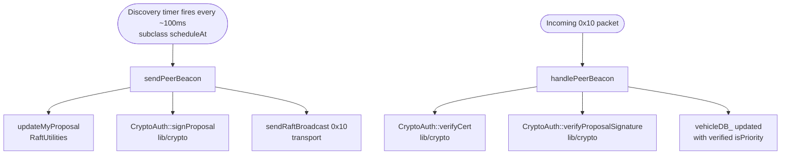
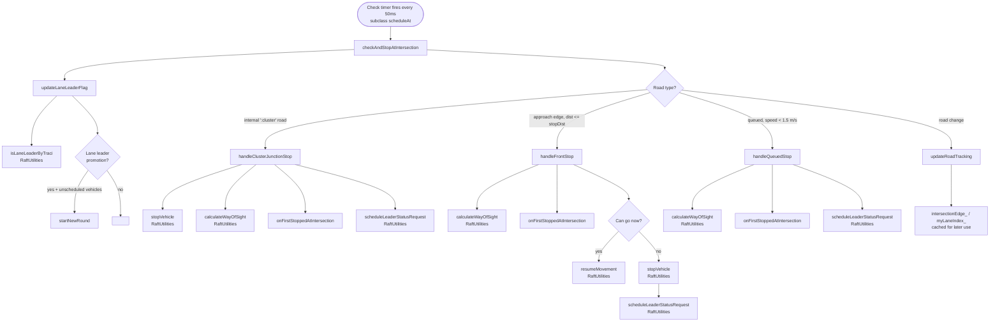
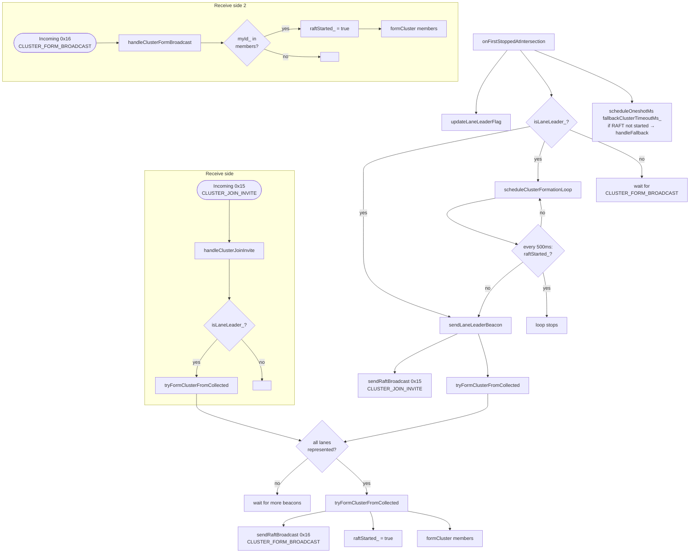
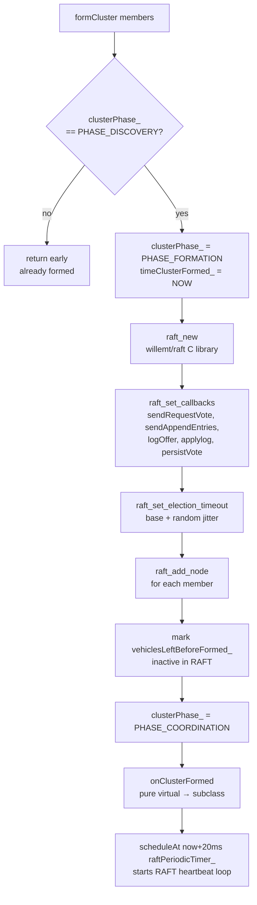
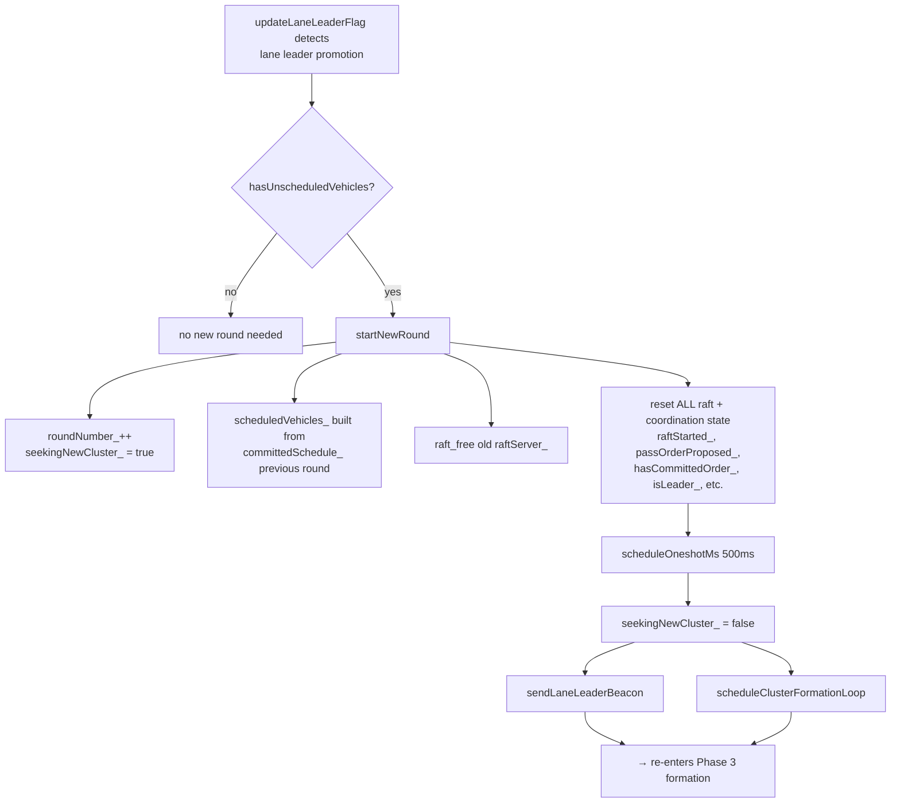

# RaftDiscovery — Function Call Flowchart

All functions live in `src/raft/RaftDiscovery.cc` unless marked with their source file.

---

## Phase 1 — DISCOVERY: Peer beacons

---

## Phase 2 — STOP DETECTION: checkAndStopAtIntersection (every 50ms)

---

## Phase 3 — FORMATION: onFirstStoppedAtIntersection → formCluster

---

## Phase 3 continued — formCluster internals

---

## Multi-round — startNewRound (called from updateLaneLeaderFlag)

---

## Summary — Entry points and handoff to RaftCore

| Entry point | Called by | Hands off to |
|---|---|---|
| `sendPeerBeacon` | subclass discovery timer | — |
| `handlePeerBeacon` | subclass msg dispatcher | — |
| `checkAndStopAtIntersection` | subclass check timer (50ms) | `onFirstStoppedAtIntersection` |
| `handleClusterJoinInvite` | subclass msg dispatcher | `tryFormClusterFromCollected` |
| `handleClusterFormBroadcast` | subclass msg dispatcher | `formCluster` |
| `formCluster` | `tryFormClusterFromCollected` or `handleClusterFormBroadcast` | `onClusterFormed` → starts `raftPeriodicTimer_` → **RaftCore** takes over |
